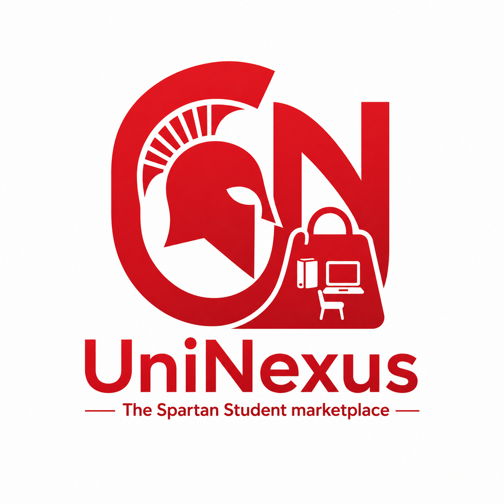

# UniNexus: The Spartan Student Marketplace



**UniNexus** is a JavaFX-based desktop application developed for the **CpE 2204** section. It serves as a dedicated marketplace where students can buy, sell, and moderate item listings. The system is built on a structured **MVC-DAO** architecture to ensure data integrity and a responsive user interface [cite: 20-27].

---

## 🛠 Tech Stack

* **Language:** Java (Backend/Core Logic) [cite: 13]
* **UI Framework:** JavaFX [cite: 14]
* **Database:** SQLite (Persistent storage) [cite: 15]
* **Local Session:** JSON (Jackson-databind for cart serialization) [cite: 16, 147]
* **Environment:** Maven (Dependency and build management) [cite: 17]

---

## 🏗 System Architecture

The project utilizes specific design patterns to separate UI from business logic:
* **Model-View-Controller (MVC):** Separates the pure frontend UI (View), the data handling (Model), and the middleman logic (Controller) [cite: 20-25].
* **Data Access Object (DAO):** A specialized layer responsible for all SQLite communication, preventing direct database calls from the UI [cite: 25, 26].
* **Singleton Pattern:** Used for the database connection manager to maintain a single active connection across all application screens [cite: 28, 29].
* **Concurrency:** Heavy database queries and authentication tasks are wrapped in `javafx.concurrent.Task` to prevent UI freezing [cite: 39, 40].

---

## 🚀 Key Features

* **Identity & Data Gateway:** Secure login and registration with role-based routing (Client vs. Admin) [cite: 102-104, 108].
* **Buyer Discovery:** A dynamic feed using `TilePane` and `ObservableList` to display approved products with real-time `LIKE` operator filtering [cite: 122-125].
* **Local Transactions:** A cart system that serializes item lists into a local `cart.json` file on the hard drive for session persistence [cite: 147-148].
* **Seller Pipeline:** A dedicated form for product submission with strict data entry validation, including price type-casting and description length limits [cite: 98-101, 132].
* **Admin Moderation:** A dashboard to approve or reject pending product submissions, updating the SQLite database state accordingly [cite: 135-136].

---

## 📂 Project Structure

```text
StudentMarketplace/
├── pom.xml                   # Maven dependencies [cite: 43]
├── app_data/                 # Local storage for session files
│   ├── cart.json             # Serialized cart data [cite: 185]
│   └── images/               # Uploaded product images [cite: 186]
├── src/main/java/com/marketplace/
│   ├── Main.java             # Entry point and routing logic [cite: 192]
│   ├── UserSession.java      # Session Singleton [cite: 192]
│   ├── model/                # User and Product entity classes [cite: 193-195]
│   ├── dao/                  # Database logic (UserDAO, ProductDAO) [cite: 207-210]
│   └── controller/           # UI logic for every functional screen [cite: 212-222]
└── src/main/resources/
    ├── view/                 # FXML layout files [cite: 224-238]
    └── database/             # marketplace.db SQLite file [cite: 239-240]
```

---

## 👥 The Team: CpE 2204

### 2ND GROUP
* **Group 1:** Identity & Data Gateway (Authentication & Database Foundation) [cite: 102-111, 281].
* **Group 4:** The Seller & Admin Experience (Forms, Validation, & Moderation) [cite: 127-136, 284].
* **Group 7:** The Buyer Experience (Feed, Discovery, & Background Tasks) [cite: 117-125, 282].
* **Group 8:** Cart & Local Transactions (JSON Serialization & Session Caching) [cite: 140-151, 286].
* **Group 9:** Integration, QA & Provisioning (DevOps, Maven Setup, & Routing) [cite: 153-169, 288].

---

## 🔗 Repository
[https://github.com/JoshuaGzzz/UniNexus](https://github.com/JoshuaGzzz/UniNexus)
